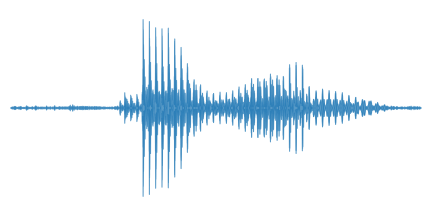
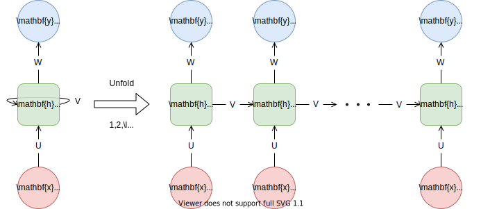
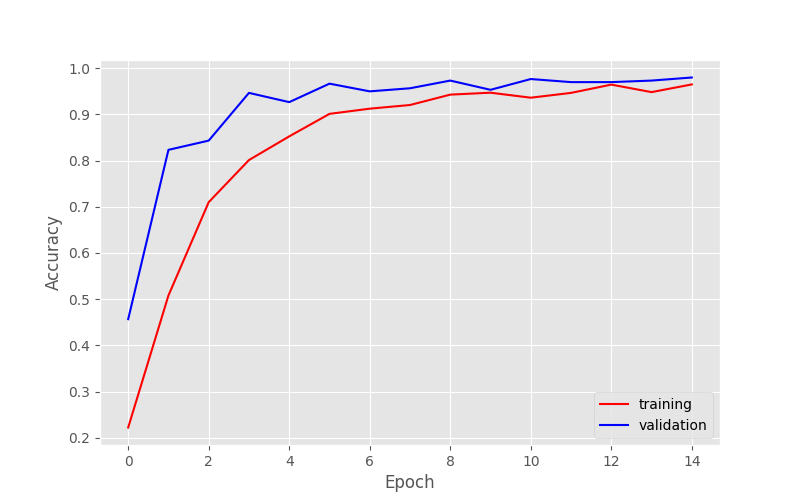
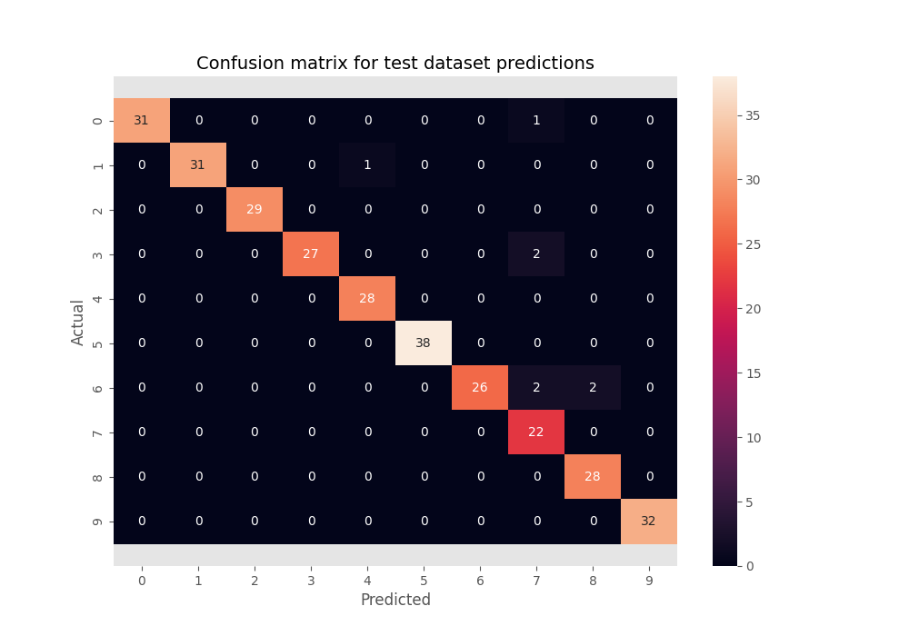

# Speech Recognition on Spoken Digit Dataset 

This github repository contains the code that I have used to perform **Speech Recognition on Spoken Digit Dataset**. In other words this github repository contains the code for isolated word recognition on the Spoken Digit Dataset consisting of trimmed audio signals of spoken digits.

## Dataset Description 

The dataset used here is [Free Spoken Digit Dataset (FSDD)](https://github.com/Jakobovski/free-spoken-digit-dataset.git), which is an open source dataset consisting of audio recordings of the **spoken digits 0-9 in English**. The dataset is essentially a spoken version of the popular [MNIST dataset](http://yann.lecun.com/exdb/mnist/) which contains images of handwritten digits. 

<p align="center">
    
    
    
    <br/>
    Hand-written and spoken digit 7 from the MNIST and FSDD datasets, respectively.
    <br/>
</p>

## Problem Statement

The dataset contains audio recordings of the spoken digits 0-9 in English. Each audio recording is consisting of the utterance of a single word. The task is to determine the word that was uttered in each of the recordings, given the audio signal of the recording. 

## Approch

There are many different ways to represent audio, including [raw digital signals](https://en.wikipedia.org/wiki/Digital_audio), [spectrograms](https://en.wikipedia.org/wiki/Spectrogram), [chromagrams](https://en.wikipedia.org/wiki/Chroma_feature), [scalograms](https://en.wiktionary.org/wiki/scalogram) and [Mel-spectrograms](https://medium.com/analytics-vidhya/understanding-the-mel-spectrogram-fca2afa2ce53). However, one of the most effective and frequently used representations in the domain of automatic speech recognition is [Mel-Frequency Cepstral Coefficients (MFCCs)](https://en.wikipedia.org/wiki/Mel-frequency_cepstrum). MFCCs are a collection of features that can be used to represent a section (or frame) of audio. The number of MFCCs to use is an adjustable hyper-parameter, but this is generally fixed to specific values such as 13 or 40. For these experiments, I choose to use 39 MFCCs (40, but with the constant offset coefficient remove as it does contain relevant information). 

**Standardization** is performed on MFCCs of a audio signal. After Standardization each frame of MFCCs is passed one by one sequentially on every iteration of a Bidirectional LSTM RNN.

### Bidirectional Recurrent Neural Network with Long Short-Term Memory (BiLSTM-RNN)

**RNN** - The **Recurrent Neural Network (RNN)** is a type of neural network that is designed to handle sequential data of various length. RNNs work by feeding the input sequence into an RNN cell one time step at a time.

<p align="center">
    <br/>
    RNN cell unfolded to accept an input sequence with <span></span> time steps.
</p>

For sequence classification, we typically only take the last hidden state vector <span></span> and use this for classification, effectively using it to represent the context of the entire sequence.

**LSTM RNN** - However, the vanilla RNN suffers from issues with vanishing gradients, effectively resulting in earlier parts of the input sequence being "forgotten". The **Recurrent Neural Network with Long Short-Term Memory (LSTM-RNN)** is a special way of defining a RNN cell by using gates to allow the network to decide what information to remember, and for how long to remember it.

**Bidirectional LSTM RNN** - We can further improve the performance of LSTM RNN by introducing the concept of bidirectionality. A **Bidirectional Recurrent Neural Network with Long Short-Term Memory (BiLSTM-RNN)** uses two cells: one to process the input sequence in the normal forward direction, and one to process the sequence backwards.

The **last hidden state from Bidirectional LSTM RNN** is then passed to a **Dropout Layer**. Then the result from the Dropout layer is passed to a **Linear Feed Forward Neural Netowork** followed by **ReLU Activation** and a **Dropout Layer**. The resultant is then passed again through a **Linear Feed Forward Neural Network** and then **LogSoftmax function** is applied to get classification result. 

## Model Diagram

<p align="center">
 
</p>

## Training     Results

| Dataset      | Accuracy (%) |
| ---------- | ----------------- |
| Training   | 96.50             |
| Validation | 98.00             |
| Testing | 97.33             |

<p align="center">
 
 <br/>
 Training History
 <br/>
</p>

<p align="center">
 
 <br/>
 Confusion Matrix
 <br/>
</p>

Following are the hyperparameters (The below hyperparamter settings were found to be optimal): 

* Batch size (unchanged) : **64**
* Number of epochs (unchanged) : **15**
* Learning rate (unchanged) : **0.002** with **Adam Optimizer**
* Number of MFCCs : **39**
* Number of LSTM layer : **1**
* Number of Hidden state dimensions : **50**
* Number of units in Linear Feed forward Neural Network : **50**

The dataset was splited as **80% train dataset**, **10% validation dataset** and **10% test_dataset** during this experiment.

## Requirements

`pip` version used is **22.0.2** and `python3` version used is **3.10.6**

The following packages are used in this project: 
```bash 
matplotlib==3.5.3
numpy==1.23.3
pandas==1.4.3
PyYAML==6.0
scikit_learn==1.1.2
seaborn==0.12.1
torch==1.12.1
torchaudio==0.12.1
torchvision==0.13.1
tqdm==4.64.0
```

